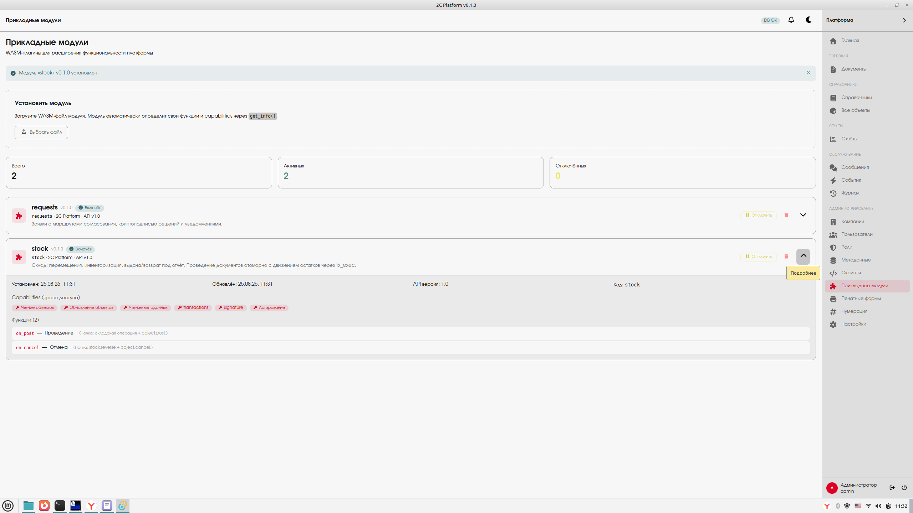

# 2C Platform

Конфигурируемая документо-событийная платформа для малого и среднего бизнеса.

[](LICENSE)
[](https://www.rust-lang.org/)
[](https://www.mongodb.com/)

**Следующее поколение учётных систем** — открытая платформа, на которой можно построить свой бизнес-софт без привязки к одному вендору.


## Зачем?

Российский МСБ зажат между 1С (тяжёлый, закрытый, дорогой в кастомизации) и западными решениями (SAP, Odoo, Zoho — санкционные риски, плохая локализация). Рынку нужна современная открытая альтернатива с конфигурируемой архитектурой.

2C Platform — это не готовая бухгалтерия, а **платформа-конструктор**:

- **Метамодель** — новые типы документов и справочников без перекомпиляции;
- **WASM-плагины** — сторонние разработчики пишут модули в песочнице;
- **Транзакционный механизм `tx_exec`** — атомарные цепочки операций;
- **Гибридная архитектура** — инварианты нативно (Rust), оркестрация в песочнице (WASM).

## Стек

- **Backend:** Rust / Tokio / MongoDB 7.0+ (replica set) / Tauri v2
- **Frontend:** Svelte 5 + TypeScript + Vite 8 + Tailwind CSS v4 + Skeleton UI
- **Плагины:** Extism/wasmtime (WASM) / Rhai (скрипты)
- **Криптоподпись:** КриптоПро CSP 5.0 через cpcsp-rs (Linux-first)

## Возможности

### Ядро платформы

- **Метамодель** — 17 типов полей, состояния и переходы, формы и действия;
- **Документы как объекты** — единая модель для документов, справочников, реестров;
- **Event Store** — неизменяемый журнал событий, полная история изменений;
- **RBAC** — роли, политики доступа, изоляция компаний;
- **Аудит** — каждое действие со снимком исполнителя;
- **Версионирование** — история версий с восстановлением;
- **Криптоподпись** — ГОСТ Р 34.11-2012, настраиваемые политики.

### Транзакционный механизм

- **`tx_exec`** — атомарное выполнение пачки декларативных операций;
- **Идемпотентность** — защита от повторного выполнения через `idempotency_key`;
- **Связывание выходов** — результат одной операции доступен следующей через `$ref`;
- **Журнал внутри транзакции** — бизнес-изменения и запись журнала коммитятся атомарно.

### Модульная система

- **Нативные Rust-модули** — инварианты и нагрузка (Склад, Учёт);
- **WASM-плагины** — оркестрация и сторонние модули (Заявки, Торговля);
- **Rhai-скрипты** — хуки, валидаторы, формулы в песочнице.

### Прикладные модули

- **Заявки** — маршруты согласования с криптоподписью;
- **Склад** — FIFO, партии, подотчёт, инвентаризация;
- **Торговля** — поступления, реализации, возвраты;
- **Учёт** — двойная запись, план счетов, ОСВ, журнал проводок.

## Требования

- **Rust** stable (edition 2021)
- **Node.js** ≥ 18 + npm
- **MongoDB** 7.0+ в режиме replica set (для транзакций) — [рецепты поднятия](docs/mongodb-setup.md)
- **КриптоПро CSP** 5.0 (Linux: `/opt/cprocsp/`) — опционально, для ЭЦП
- **libudev-dev** + pkg-config (для tokio-serial)

## Быстрый старт

```bash
# 1. Клонировать репозиторий
git clone https://github.com/mamon-t/2c_platform.git
cd 2c_platform

# 2. Установить зависимости
npm install

# 3. Настроить .env (или скопировать .env.example)
echo 'MONGODB_URI=mongodb://localhost:27017/2c_platform?replicaSet=rs0' > .env
echo 'MONGODB_DATABASE=2c_platform' >> .env
echo 'JWT_SECRET=dev-secret-change-me' >> .env

# 4. Запустить в dev-режиме
npm run tauri:dev

# 5. В окне приложения: подключиться к MongoDB → войти admin/admin
```

## Сборка WASM-плагинов

```bash
cd wasm-modules/requests && cargo build --target wasm32-unknown-unknown --release
cd wasm-modules/stock   && cargo build --target wasm32-unknown-unknown --release
cd wasm-modules/trade   && cargo build --target wasm32-unknown-unknown --release
cd wasm-modules/convert && cargo build --target wasm32-unknown-unknown --release
```

> Если линковщик ругается на `-fuse-ld=lld` — проверьте `~/.cargo/config.toml`.
> Локальные `.cargo/config.toml` в каждом wasm-модуле перекрывают глобальный флаг.

## Тестирование

```bash
cd src-tauri

# Unit + plugin тесты (без БД)
cargo test

# Интеграционные тесты (нужна живая MongoDB replica set — docs/mongodb-setup.md)
TX_TEST_MONGO=1 cargo test --test ledger_test
TX_TEST_MONGO=1 cargo test --test stock_engine_test
TX_TEST_MONGO=1 cargo test --test tx_executor_test
TX_TEST_MONGO=1 cargo test --test stock_orchestrator_test
TX_TEST_MONGO=1 cargo test --test trade_orchestrator_test
```

### Проверки качества

```bash
cargo check                    # компиляция backend
npx svelte-check               # типы фронтенда
npm run build                  # production build фронтенда
```

## Модули

| Модуль | Тип | Описание |
| --- | --- | --- |
| Заявки | WASM | Маршруты согласования, ЭЦП |
| Склад | Native | FIFO, подотчёт, инвентаризация |
| Торговля | WASM | Поступления, реализации, возвраты |
| Учёт | Native | Двойная запись, план счетов РСБУ, ОСВ |
| Устройства | Native | Сканеры, весы (ККМ — v0.3) |

## Документация

- [docs/technical_report.md](docs/technical_report.md) — технический отчёт и снимок реализованного;
- [example/README.md](example/README.md) — **Plugin API v1**: полный контракт WASM-модулей;
- [docs/mongodb-setup.md](docs/mongodb-setup.md) — поднятие MongoDB replica set для разработки;
- [docs/testing-stock.md](docs/testing-stock.md) — ручные сценарии проверки склада;
- [docs/testing-trade.md](docs/testing-trade.md) — ручные сценарии проверки торговли;
- [wasm-modules/requests/README.md](wasm-modules/requests/README.md) — документация модуля «Заявки».

## Написание своего WASM-плагина

SDK задокументировано в [example/README.md](example/README.md):

1. **Манифест** `get_info()` — код, версия API, capabilities, permissions, каталог функций;
2. **26 host-функций** — объекты, метаданные, KV-хранилище, транзакции `tx_exec`, события, подпись;
3. **Конверт ответов** `{ok, data | error}` и ресурсные лимиты песочницы;
4. **Минимальный образец** — [`example/hello`](example/hello): собирается одной командой и ставится через UI («установил → сразу использует»).

## Contributing

Мы приветствуем вклад в проект:

1. Форкните репозиторий;
2. Создайте ветку для фичи (`git checkout -b feature/amazing-feature`);
3. Сделайте коммит (`git commit -m 'Add amazing feature'`);
4. Запушьте в ветку (`git push origin feature/amazing-feature`);
5. Откройте Pull Request.

## Roadmap

### v0.2 (в работе)

- [ ] Серверный режим на Axum
- [ ] Веб-клиент
- [ ] Серийные номера для склада
- [ ] Email-уведомления
- [ ] Эскалации в заявках (`timeout_hours`, `is_required`)

### v0.3 (планы)

- [ ] ККМ (онлайн-кассы)
- [ ] Marketplace модулей
- [ ] CRM
- [ ] Банковские интеграции
- [ ] WebSocket для messaging

## Лицензия

Проект лицензирован под **Apache License 2.0**. Полный текст — в файле [LICENSE](LICENSE), атрибуция — в файле [NOTICE](NOTICE).

**Примечание о КриптоПро CSP:** КриптоПро CSP 5.0 — проприетарный продукт компании «Крипто-Про». Платформа интегрируется с ним через библиотеку cpcsp-rs, но не включает и не распространяет сам КриптоПро CSP. Для работы ЭЦП требуется отдельная лицензия от «Крипто-Про».

## Автор

**Михаил Алексеев** (aka Mamon-T) — [github.com/mamon-t](https://github.com/mamon-t)

## Поддержка

- [Issues](https://github.com/mamon-t/2c_platform/issues) — баги и предложения;
- [Discussions](https://github.com/mamon-t/2c_platform/discussions) — вопросы и обмен опытом.
